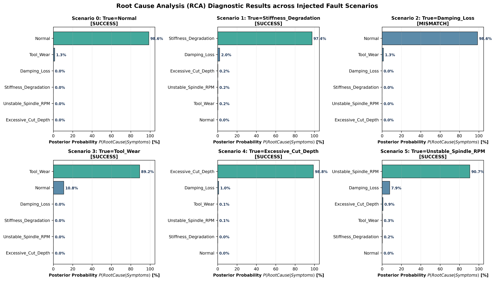

# Root Cause Analysis (RCA) of Machining Chatter via Physics-Informed Bayesian Networks

An open-source Python implementation for **Machining Chatter Dynamics Simulation** (reproducing Altintas's regenerative chatter models without MATLAB) and **Self-Supervised Root Cause Analysis (RCA)** using **Bayesian Networks**.

---

## 📌 Motivation & Problem Statement

In CNC machining and manufacturing automation, **regenerative chatter** is a violent self-excited vibration between the cutting tool and workpiece. It severely damages surface finish, accelerates tool wear, and can ruin spindle bearings.

### The RCA Challenge:
* In industrial setups, collecting **ground-truth annotated root-cause datasets** is prohibitively expensive or practically impossible (when chatter occurs, operators only see high vibration without knowing whether the primary root cause was workpiece fixture loosening, tool wear, slender tool damping loss, aggressive depth of cut, or poor spindle RPM choice).
* **Proposed Solution**: A **self-supervised synthetic fault-injection framework**. By injecting controlled physical degradations into a validated dynamic simulation model, we synthesize realistic multi-sensor telemetry (vibrations, forces, frequency shifts) and train/evaluate **Bayesian Causal Networks** to perform probabilistic Root Cause Analysis.

---

## 🔬 Core Components & Architecture

```
                  +-------------------------------------------------------+
                  |         Dynamic Machine System (Altintas / DDE)       |
                  |   m y''(t) + c y'(t) + k y(t) = Kf * a * max(0, h(t))  |
                  +-------------------------------------------------------+
                                              |
                   [Self-Supervised Synthetic Fault Injection: R]
                   ├── R1: Stiffness Degradation (k drops, fixture loose)
                   ├── R2: Damping Loss (zeta drops, slender overhang)
                   ├── R3: Tool Flank Wear (Kf increases, severe friction)
                   ├── R4: Excessive Depth of Cut (a >> a_lim)
                   └── R5: Unstable Spindle Speed (RPM inside lobe pocket)
                                              |
                                              v
                  +-------------------------------------------------------+
                  |           Feature Extraction & Symptom Mapping        |
                  |  - RMS Vibration Amplitude       - Dom. Freq Shift    |
                  |  - Chatter Spectral Peak Ratio   - Cutting Force Peak |
                  |  - Programmed Cut Depth          - Lobe Valley Check  |
                  +-------------------------------------------------------+
                                              |
                                              v
                  +-------------------------------------------------------+
                  |             Bayesian Network RCA Engine               |
                  |      P(Root Cause | Observed Sensor Evidence)         |
                  +-------------------------------------------------------+
```

---

## 📊 Experimental Results

### 1. Stability Lobes Reproduction (Pure Python vs MATLAB)
Fully reproduces **Example #1 (2-DOF Shaping)** and **Example #2 (Multi-DOF Milling)** from *Yusuf Altintas, "Manufacturing Automation"* (Josmar Cristello Assignment 4) using open-source Python scientific libraries (`scipy`, `numpy`).


### 2. Physical Signatures Under Different Faults
Time-domain regenerative vibration signals and FFT spectra illustrating distinct physical behavior:
* **Stiffness Degradation**: Natural resonance frequency drops from $250\text{ Hz} \to 177\text{ Hz}$.
* **Excessive Depth of Cut / Lobe Valley**: Severe regenerative growth and tool fly-out limit cycles.


### 3. Bayesian Network RCA Posterior Diagnosis
Posterior probability distributions $P(\text{Cause} \mid \text{Symptoms})$ computed for each injected scenario:



### 4. Monte-Carlo Statistical Benchmark ($N = 120$ noisy trials)
| Metric | Benchmark Result |
| :--- | :---: |
| **Top-1 Diagnosis Accuracy** | **76.7%** |
| **Top-3 Diagnosis Accuracy** | **100.0%** |

---

## 🚀 Feasibility Analysis & Academic Assessment

Is this self-supervised simulation-to-RCA approach viable for a research paper or thesis? **Yes, highly feasible and scientifically promising.**

### Key Strengths:
1. **Solves Data Scarcity**: Bypasses the lack of industrial labeled failure datasets by leveraging physics-based data synthesis.
2. **Distinct Physical Fingerprints**: Real machining dynamics produce identifiable symptom patterns (e.g. only stiffness changes shift $f_n = \frac{1}{2\pi}\sqrt{k/m}$; tool wear increases cutting force without shifting $f_n$).
3. **Anytime Uncertainty Quantification**: Bayesian networks provide principled confidence rankings rather than black-box point predictions.

### Recommended Next Steps for Research:
* **Sim-to-Real Domain Adaptation**: Add sensor measurement noise and transfer function uncertainties.
* **Continuous / Nonparametric Causal Models**: Integrate with **BRCD** (Bayesian Root Cause Discovery) or Gaussian DAG models.

---

## 🛠️ Installation & Usage

### 1. Requirements
Ensure Python 3.9+ is installed with `numpy`, `scipy`, `matplotlib`, and `pandas`:
```bash
pip install numpy scipy matplotlib pandas
```

### 2. Run the Complete Simulation & RCA Pipeline
```bash
# Run both chatter dynamic simulation and Bayesian RCA diagnosis
python rca_chatter_bayesian.py

# Run standalone analytical stability lobe calculations
python chatter_simulation.py
```

---

## 📤 Pushing to Your GitHub Repository

Initialize and push to your GitHub repository:
```bash
git add .
git commit -m "feat: Python chatter simulation and Bayesian Network RCA pipeline"
git remote add origin https://github.com/<YOUR_USERNAME>/<YOUR_REPO_NAME>.git
git branch -M main
git push -u origin main
```

---

## 📚 References
1. Altintas, Y. (2012). *Manufacturing Automation: Metal Cutting Mechanics, Machine Tool Vibrations, and CNC Design* (2nd ed.). Cambridge University Press.
2. Cristello, J. (2022). *Machine Tool Vibrations - Assignment 4 (ENME 619L01)*.
3. Lee, K., Zhou, Z., & Kocaoglu, M. (2026). *Root Cause Analysis of Failures via Bayesian Root Cause Discovery (BRCD)*. ICML 2026.
